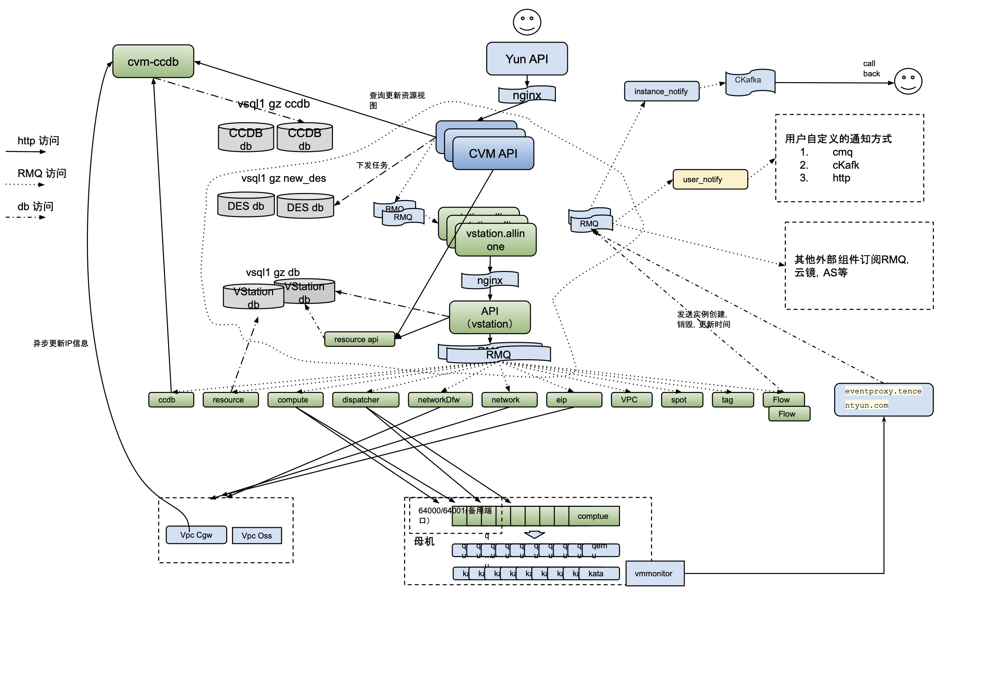

# Kubernetes Roadmap

## Cloud

## Producation Cloud Architecture



## Service System Design Architecture


## Kubernetes

### Cluster Architecture


##### Control Plane - Master Nodes

- kube-apiserver

  - ```yaml
    apiVersion: v1
    kind: Pod
    metadata:
    	name: kube-apiserver
    	namespace: kube-system
    spec:
    	containers:
    	- name: kube-apiserver
    		image: k8s.gcr.io/kube-apiserver:v1.27.1
    		command:
    		- kube-apiserver
    		- --etcd-servers=https://10.10.0.1:2379, https://10.10.0.2:2379, https://10.10.0.3:2379
    		- --service-cluster-ip-range=10.10.0.0/8
    		- --tls-cert-file=/etc/kubernetes/pki/apiserver.crt
    		- --tls-private-key-file=/etc/kubernetes/pki/apiserver.key
    ```

  - ```bash
    root      1500  1268 16 02:13 ?        00:00:15 kube-apiserver --advertise-address=192.168.0.13 --allow-privileged=true --authorization-mode=Node,RBAC --client-ca-file=/etc/kubernetes/pki/ca.crt --enable-admission-plugins=NodeRestriction --enable-bootstrap-token-auth=true --etcd-cafile=/etc/kubernetes/pki/etcd/ca.crt --etcd-certfile=/etc/kubernetes/pki/apiserver-etcd-client.crt --etcd-keyfile=/etc/kubernetes/pki/apiserver-etcd-client.key --etcd-servers=https://127.0.0.1:2379 --kubelet-client-certificate=/etc/kubernetes/pki/apiserver-kubelet-client.crt --kubelet-client-key=/etc/kubernetes/pki/apiserver-kubelet-client.key --kubelet-preferred-address-types=InternalIP,ExternalIP,Hostname --proxy-client-cert-file=/etc/kubernetes/pki/front-proxy-client.crt --proxy-client-key-file=/etc/kubernetes/pki/front-proxy-client.key --requestheader-allowed-names=front-proxy-client --requestheader-client-ca-file=/etc/kubernetes/pki/front-proxy-ca.crt --requestheader-extra-headers-prefix=X-Remote-Extra- --requestheader-group-headers=X-Remote-Group --requestheader-username-headers=X-Remote-User --secure-port=6443 --service-account-issuer=https://kubernetes.default.svc.cluster.local --service-account-key-file=/etc/kubernetes/pki/sa.pub --service-account-signing-key-file=/etc/kubernetes/pki/sa.key --service-cluster-ip-range=10.96.0.0/12 --tls-cert-file=/etc/kubernetes/pki/apiserver.crt --tls-private-key-file=/etc/kubernetes/pki/apiserver.key
    ```

  - **Producation Environment deploy as POD**

  - **Core Functions**

    - Exposing API for validation & configuration for kubernetes objects like Pods, Services, Controllers
    - Provide Frontend & `kubectl` CML Interactions to users
    - Only component in control plane to directly R&W etcd servers
    - Exposing Restful API for scheduler & controller & kubelet to access cluster objects data & status when services starting up
    - services establish a long-lived HTTP connection with kube-apiserver to watch resources change
      - `GET /api/v1/pods?watch=true`
    - Kube-apiserver send `Server-Sent` event in real-time to kube-scheduler

- kube-controller-manager

  - **Multiple controller in one process**

  - Controller: **ensuring the desired state of resource match actual state**

    - watching resource change in etcd via apiserver
    - reconciling the desired state with actual state
    - creating, updating, deleting resources to maintain stability

  - | Controller               | Function                                                     |
    | ------------------------ | ------------------------------------------------------------ |
    | Node Controller          | detect failed nodes & kick pods                              |
    | Replication Controller   | Ensure correct number of Pod replicas                        |
    | Deployment Controller    | Manages Deployments, rolling updates and rollbacks           |
    | DaemonSet Controller     | Ensures DaemonSet Pods run on every node                     |
    | StatefulSet Controller   | Ensures ordered & unique Pod deployment for stateful apps    |
    | Job Controller           | Ensures Jobs run once and complete successfully              |
    | CronJob Controller       | Schedules Jobs to run periodically like cronjob in Linux     |
    | Service Controller       | Create cloud LB for Services(cloud providers)                |
    | EndpointSlice Controller | Managees network endpoint slices for Services                |
    | Ingress Controller       | Manages external access via ingress rules                    |
    | HPA Controller           | Scales Pods up/down base on CPU/Memory (Horizontal Pod Autoscaler) |
    | PVC Controller           | Binds PersistentVolumeClaims (PVCs) to Persistent Volumes (PVs) |
    | CSR Controller           | Handles CertificateSigningRequests(CSR) for TLS authentication |

  - PVs & PVCs

    - Persistent Volume

      - storage abstraction of underlying storage(cloud/local storage)
      - Independent to the lifecycle of Pod
      - Provisioned by cluster admin / dynamically by StorageClass
      - Properties: capacity, access modes, reclaim policies, storage class
        - ReadWriteOnce
        - ReadOnlyMany
        - ReadWriteMany

    - ```yaml
      apiVersion: v1
      kind: PersistentVolume
      metadata:
        name: example-pv
      spec:
        capacity:
          storage: 10Gi
        accessModes:
          - ReadWriteOnce
        persistentVolumeReclaimPolicy: Retain
        storageClassName: standard
        hostPath:
          path: "/mnt/data"
      ```

    - Persistent Volume Claims

      - Req for storage by user

        - Amount capacity needed
        - Access mode
          - ReadWriteOnce
          - ReadWriteMany
          - ReadOnlyMany
        - Storage class belongs to

      - ```yaml
        apiVersion: v1
        kind: PersistentVolumeClaim
        metadata:
          name: example-pvc
        spec:
          accessModes:
            - ReadWriteOnce
          resources:
            requests:
              storage: 10Gi
          storageClassName: standard
        ```

    - Process

      1. Cluster admin creates a PV
      2. Developer create a PVC requesting storage
      3. Kubernetes control plane controller-PVC controller find matching PV & binds to PVC
      4. Pod uses PVC to mount storage

    - ```yaml
      apiVersion: v1
      kind: Pod
      metadata:
        name: example-pod
      spec:
        containers:
          - name: app-container
            image: nginx
            volumeMounts:
              - mountPath: "/usr/share/nginx/html"
                name: storage-volume
        volumes:
          - name: storage-volume
            persistentVolumeClaim:
              claimName: example-pvc
      ```

    - Pod using PVC

- Kube-schduler

  

  - assigns Pods to Nodes, Filtering & Scoring

    - **Identify unscheduled Pods** `spec.nodeName`
    - **Pre-Scheduling: Filtering**
      - Node taints & tolerations - compatible nodes
      - Resource requests & limits - CPU/ Memory/ GPU
      - Node Selectors & Affinity - lables `nodeSelector.nodeAffinity`
      - Pod Affinity/ Anti-Affinity - scheduled together or apart
      - Node Readiness - Node's state Ready
    - **Node Scoring** reamaining node is assigned a score 0-100
      - Least Allocated Priority - More CPU & Memory
      - Balanced Resource Allocation - Even distributed across nodes
      - Node Affinity Priority - Prefered node labels
      - Pod Topology Spread - avoid cluster hotspots
      - Custom Plugins & extenders - custom scoring logic
    - **Assign Pod to Best Node**
      - **scheduer** binds Pod to highest-scoring node
      - update `spec.nodeName` in Pod definition
      - kubelet on chosen node pulls the container images to starts the Pod

  - **Persistent Watch Connection (watch=true)**

    - kube-scheduler **establishes a long-lived HTTP connection** to **watch for unscheduled pods**.
    - This connection remains **open until closed by the server or network issues**.
      - Retry connect when lost connection

  - Streaming Updates via Server-Sent Events (SSE)

    - Instead of polling repeatedly, kube-scheduler receives updates in real-time as events from kube-apiserver. 
    - This is more efficient than making one-time HTTP requests for new pods.

  - Pod Scheduling Decision → One-Time HTTP Call

    - Once a pod is scheduled, kube-scheduler sends a one-time PATCH request to update the pod’s .spec.nodeName.

    - ```json
      PATCH /api/v1/namespaces/default/pods/example-pod
      Content-Type: application/strategic-merge-patch+json
      
      {
        "spec": {
          "nodeName": "worker-node-1"
        }
      }
      ```

- ETCD

  - **Distributed key-value store & primary data store** for entire cluster

    - Configuration Data
    - State information
    - Metadata
    - Pod Configuration
    - Node Configuration & Status
    - Runtime information

  - **Persistent**

  - **Deployment & Core Design**

    - Raft Consensus Leader & followers replica
    - Odd number deploy
    - Only kube-apiserver directly interacts with etcd
    - **Access etcd v3 API over GRPC**
      - Raft Consensus
    - Write
      - follower will forward req to leader
      - leader writes data to LOG
      - Raft Consensus - replicates data to followers
      - Majority confirms, write is committed (Node/2 + 1)
      - etcd response to kube-apiserver
    - Read
      - Strong consistency = True
        - Follower will forward req to leader
      - Strong consistency = False
        - Read req handled locally

  - **RAM && Persistent Volume**

  - **HA**

    - Odd number multi-node cluster
    - Raft consensus algorithm
    - Leader fails, auto elect new Leader
    - Write req data LOG replication
    - node /2 + 1 majority nodes confirm
      - Majority down, writes will be rejected
    - failed node recovers, automatically syncs data from leader
    - Deploy as a **Static POD**

  - **ETCD Watch API**

    - Kube-apiserver use etcd **Watch API** monitor changes in cluster in real time

    - Cluster state - nodes, pods, deployments

    - Configuration data - ConfigMaps, Secrets

    - Service discovery information

    - instant & real time notifications

    - kube-apiserver watches etcd changes in **Pods, Nodes, Deployment**

    - kube-apiserver send real-time event to controllers & schedulers

    - **ReplicaSet Contoller** watches Pod deletetions via kube-apiserver

    - **Scheduler** watches unshceduled Pods via kube-apiserver

    - **Kubelet** watches changes in Pods assigned to it's Node

    - **Core Design**

      - **Changed etcd first, then modify resources**

    - **Performance Optimizations**

      - Caching
        - Kube-apiserver caches watch results to avoid too often access
      - Compaction
        - Compacted older version to avoid large watch event histories
      - Delta Watches
        - Watches only return changes instead of full object lists

    - **lient-go library** to interact with etcd >>

    - ```go
      package main
      
      import (
          "context"
          "fmt"
          "log"
      
          metav1 "k8s.io/apimachinery/pkg/apis/meta/v1"
          "k8s.io/client-go/kubernetes"
          "k8s.io/client-go/rest"
          "k8s.io/apimachinery/pkg/watch"
      )
      
      func main() {
          // Create Kubernetes client
          config, err := rest.InClusterConfig()
          if err != nil {
              log.Fatal(err)
          }
          clientset, err := kubernetes.NewForConfig(config)
          if err != nil {
              log.Fatal(err)
          }
      
          // Watch for changes in pods
          watchInterface, err := clientset.CoreV1().Pods("").Watch(context.TODO(), metav1.ListOptions{})
          if err != nil {
              log.Fatal(err)
          }
          
          fmt.Println("Watching for pod changes...")
          for event := range watchInterface.ResultChan() {
              fmt.Printf("Event Type: %s, Pod Name: %s\n", event.Type, event.Object.(*metav1.PartialObjectMetadata).Name)
          }
      }
      ```

  - ✅ **Instant Updates**: No polling; kube-scheduler reacts instantly to new pods.

  - ✅ **Efficient Resource Allocation**: Scheduler only processes relevant pods.

  - ✅ **Decentralized Scheduling**: Each kube-scheduler instance can handle scheduling independently.

  - ✅ **Scalability**: Large clusters can distribute scheduling across multiple schedulers.

  - **ETCD Service Discovery**

    - Kube-apiserver stores all cluster state in etcd

      - **Service info**
      - **Endpoint info**

    - Kube-proxy & CoreDNS watch the kube-apiserver for changes of

      - **Service**

        - An abstraction that defines a logical set of Pods and a policy by which to access them

        - ```yaml
          apiVersion: v1
          kind: Service
          metadata:
            name: my-service
          spec:
            selector:
              app: my-app
            ports:
              - protocol: TCP
                port: 80       # Service port
                targetPort: 8080  # Pod's container port
          ```

      - **Endpoint**

        - Dynamically updated list of IP addresses and ports whenever a Service is created 

        - Map services to real Pods IP & Ports

        - ```yaml
          apiVersion: v1
          kind: Endpoints
          metadata:
            name: my-service
          subsets:
            - addresses:
                - ip: 10.0.0.3
                - ip: 10.0.0.4
              ports:
                - port: 8080
          ```

    - App use **CoreDNS** to resolve service name into pod IPs

    - Flow

      - `kubectl expost deployment my-app --port= --target-port= --name=` **Create & Store Service info in etcd, service gets a VIP**
      - **Pods register IPs as Endpoints**, kube-apiserver store in etcd
      - Kube-proxy **watches changes & updates**
      - Kube-proxy **updates IPTables/IPVS rules**
      - CoreDNS dynamically resolves server names

- Cloud-controller-manager

  - 

- **Static POD**

  - Control plane services deploy as Static POD
  - Managed directly by **kubelet** locally
  - Not though kube-apiserver
  - **Critical system components**
    - Kube-apiserver
    - Kube-controller-manager
    - Kube-schdueler
    - etcd
    - ecfe network
    - fluent log management
    - Prometheus/Victoria - metric performance &fault management
    - calico / multus network
  - **Work Process**
    1. **kubelet** continuously watches manifest file `/etc/kubernetes/manifests`
    2. **New manifest file added**, **Create a static POD**
    3. **Manifest file modified**, Update POD accordingly
    4. **Manifest file is deleted**, Stops and Delete static PODS
  - Static POD does not have ReplicaSet or Deployment
    - Only Controled by **Manifest** file content


##### Data Plane - Worker Nodes

 


