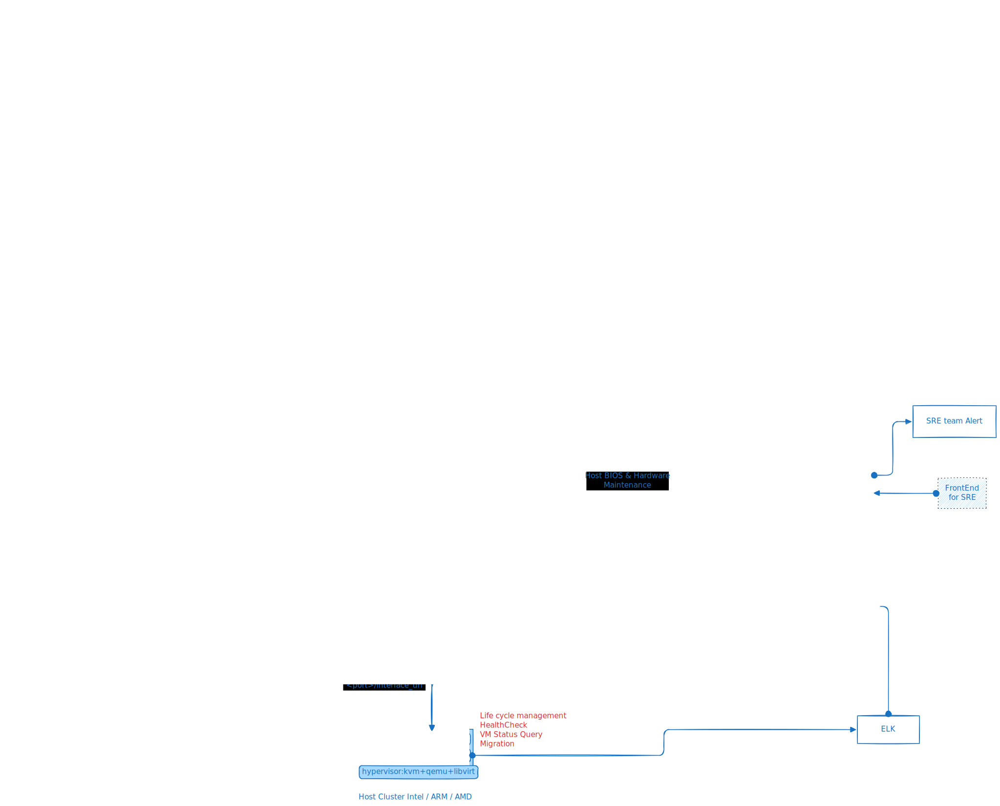
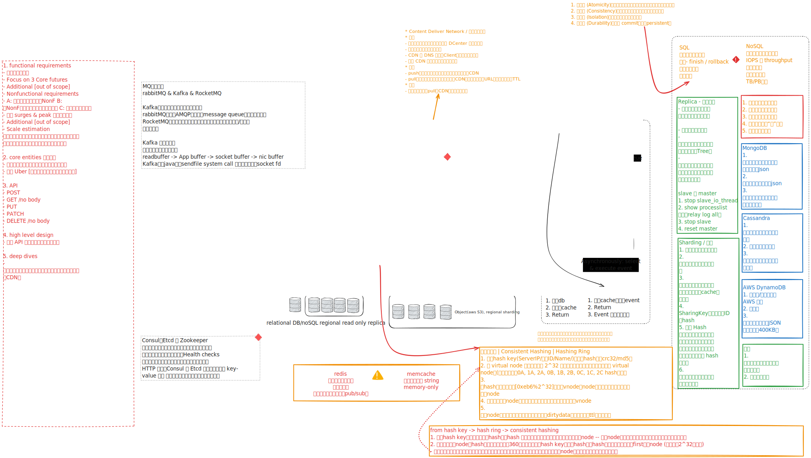
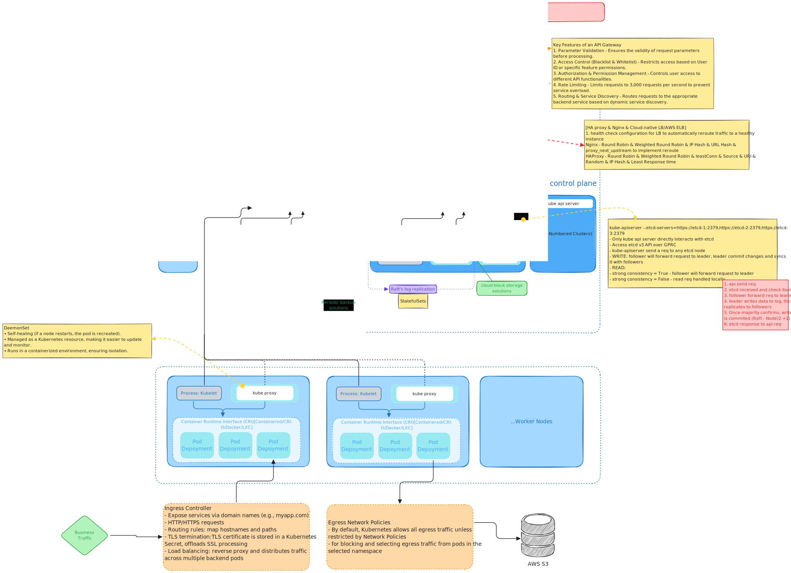
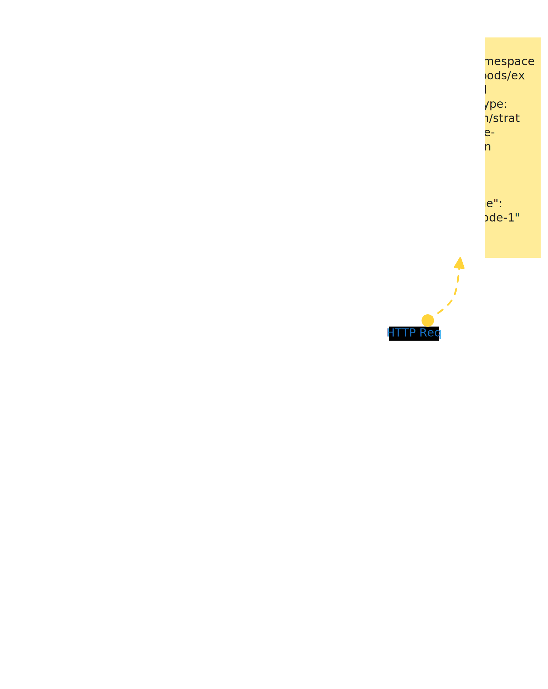
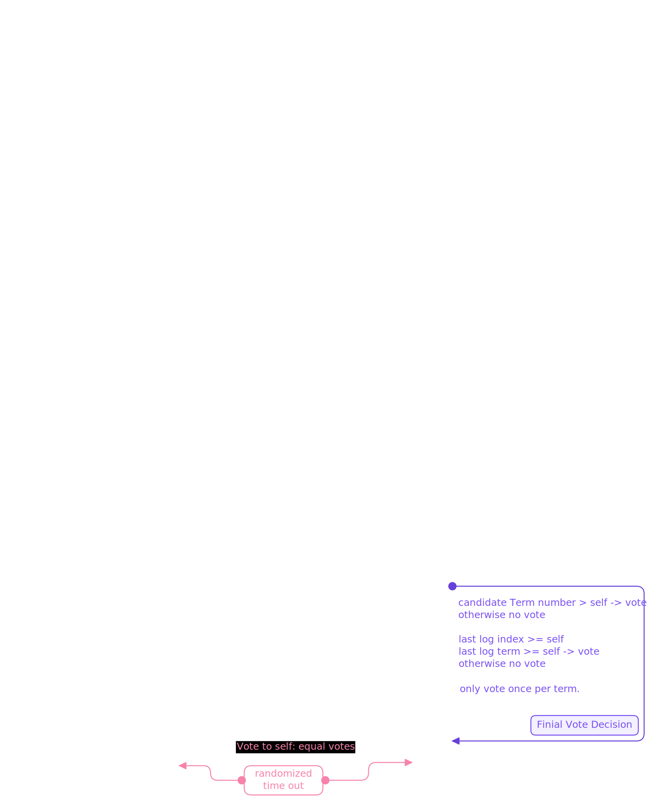
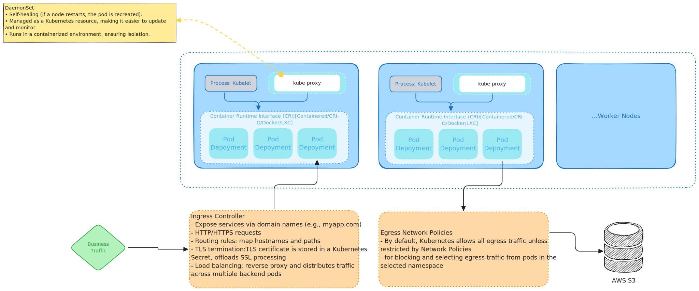
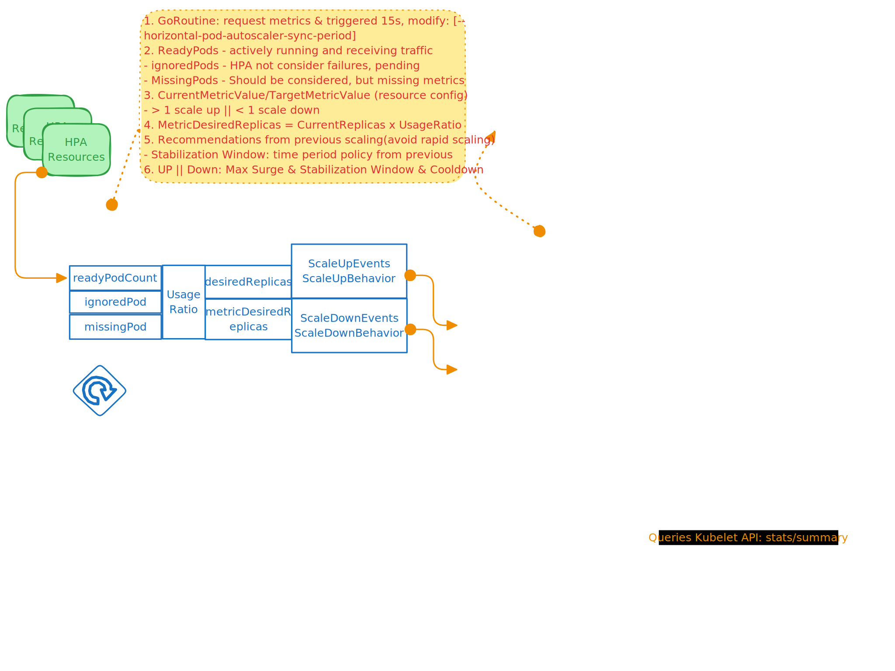
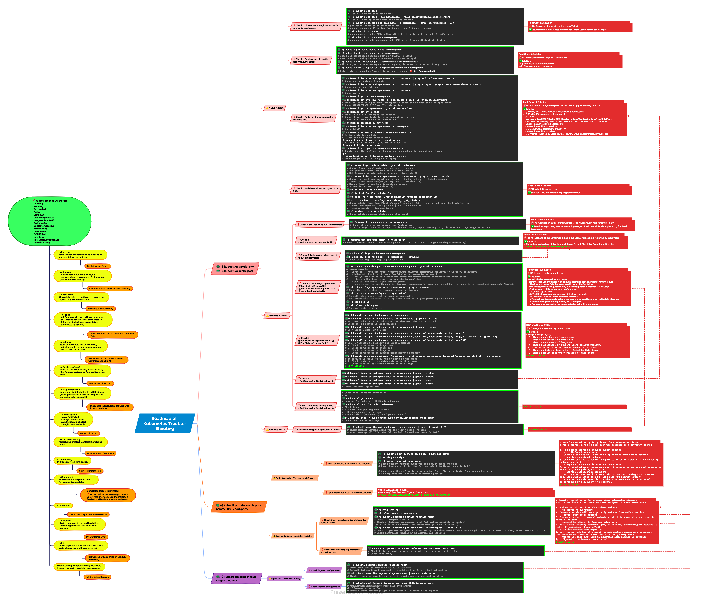
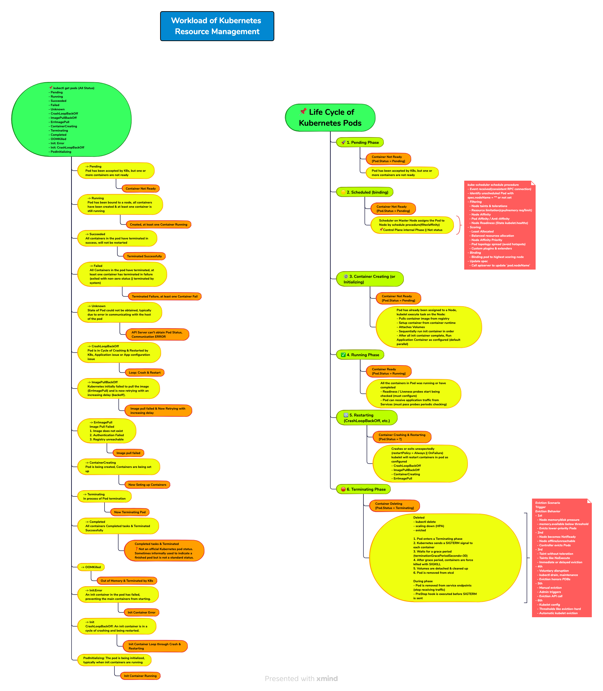

# Kubernetes Roadmap

## 🚀 Cloud

### 🔥 Producation Cloud Architecture



---

### 🔥 Service System Design Architecture



---

## 🚀 Kubernetes

### 🔥 Cluster Architecture



---

#### 💡 1. Control Plane - Master Nodes

##### 📌 1.1 kube-apiserver

- ```yaml
  apiVersion: v1
  kind: Pod
  metadata:
  	name: kube-apiserver
  	namespace: kube-system
  spec:
  	containers:
  	- name: kube-apiserver
  		image: k8s.gcr.io/kube-apiserver:v1.27.1
  		command:
  		- kube-apiserver
  		- --etcd-servers=https://10.10.0.1:2379, https://10.10.0.2:2379, https://10.10.0.3:2379
  		- --service-cluster-ip-range=10.10.0.0/8
  		- --tls-cert-file=/etc/kubernetes/pki/apiserver.crt
  		- --tls-private-key-file=/etc/kubernetes/pki/apiserver.key
  ```

- ```bash
  root      1500  1268 16 02:13 ?        00:00:15 kube-apiserver --advertise-address=192.168.0.13 --allow-privileged=true --authorization-mode=Node,RBAC --client-ca-file=/etc/kubernetes/pki/ca.crt --enable-admission-plugins=NodeRestriction --enable-bootstrap-token-auth=true --etcd-cafile=/etc/kubernetes/pki/etcd/ca.crt --etcd-certfile=/etc/kubernetes/pki/apiserver-etcd-client.crt --etcd-keyfile=/etc/kubernetes/pki/apiserver-etcd-client.key --etcd-servers=https://127.0.0.1:2379 --kubelet-client-certificate=/etc/kubernetes/pki/apiserver-kubelet-client.crt --kubelet-client-key=/etc/kubernetes/pki/apiserver-kubelet-client.key --kubelet-preferred-address-types=InternalIP,ExternalIP,Hostname --proxy-client-cert-file=/etc/kubernetes/pki/front-proxy-client.crt --proxy-client-key-file=/etc/kubernetes/pki/front-proxy-client.key --requestheader-allowed-names=front-proxy-client --requestheader-client-ca-file=/etc/kubernetes/pki/front-proxy-ca.crt --requestheader-extra-headers-prefix=X-Remote-Extra- --requestheader-group-headers=X-Remote-Group --requestheader-username-headers=X-Remote-User --secure-port=6443 --service-account-issuer=https://kubernetes.default.svc.cluster.local --service-account-key-file=/etc/kubernetes/pki/sa.pub --service-account-signing-key-file=/etc/kubernetes/pki/sa.key --service-cluster-ip-range=10.96.0.0/12 --tls-cert-file=/etc/kubernetes/pki/apiserver.crt --tls-private-key-file=/etc/kubernetes/pki/apiserver.key
  ```

- **Producation Environment deploy as POD**

- **Core Functions**

  - Exposing API for validation & configuration for kubernetes objects like Pods, Services, Controllers
  - Provide Frontend & `kubectl` CML Interactions to users
  - Only component in control plane to directly R&W etcd servers
  - Exposing Restful API for scheduler & controller & kubelet to access cluster objects data & status when services starting up
  - services establish a long-lived HTTP connection with kube-apiserver to watch resources change
    - `GET /api/v1/pods?watch=true`
  - Kube-apiserver send `Server-Sent` event in real-time to kube-scheduler

---

##### 📌 1.2 kube-controller-manager

- **Multiple controller in one process**

- Controller: **ensuring the desired state of resource match actual state**

  - watching resource change in etcd via apiserver
  - reconciling the desired state with actual state
  - creating, updating, deleting resources to maintain stability

- | Controller               | Function                                                     |
  | ------------------------ | ------------------------------------------------------------ |
  | Node Controller          | detect failed nodes & kick pods                              |
  | Replication Controller   | Ensure correct number of Pod replicas                        |
  | Deployment Controller    | Manages Deployments, rolling updates and rollbacks           |
  | DaemonSet Controller     | Ensures DaemonSet Pods run on every node                     |
  | StatefulSet Controller   | Ensures ordered & unique Pod deployment for stateful apps    |
  | Job Controller           | Ensures Jobs run once and complete successfully              |
  | CronJob Controller       | Schedules Jobs to run periodically like cronjob in Linux     |
  | Service Controller       | Create cloud LB for Services(cloud providers)                |
  | EndpointSlice Controller | Managees network endpoint slices for Services                |
  | Ingress Controller       | Manages external access via ingress rules                    |
  | HPA Controller           | Scales Pods up/down base on CPU/Memory (Horizontal Pod Autoscaler) |
  | PVC Controller           | Binds PersistentVolumeClaims (PVCs) to Persistent Volumes (PVs) |
  | CSR Controller           | Handles CertificateSigningRequests(CSR) for TLS authentication |
  | Namespace Controller     | Maintains the existence of namespaces & Sync Namespace objects |
  
- **Conclusion**

  - Controllers work by interacting with Kubernetes apiserver
  - Observing changes to the desired state, taking actions to reconcile the observed state with the desired state
  - Controller use ETCD watch to monitor changes via apiserver
  - Controllers contribute to self-healing and declarative nature of Kubernetes
  - Enabling automatic and scalable management of apps and infrastructure
  
- PVs & PVCs

  - Persistent Volume

    - storage abstraction of underlying storage(cloud/local storage)
    - Independent to the lifecycle of Pod
    - Provisioned by cluster admin / dynamically by StorageClass
    - Properties: capacity, access modes, reclaim policies, storage class
      - ReadWriteOnce
      - ReadOnlyMany
      - ReadWriteMany

  - ```yaml
    apiVersion: v1
    kind: PersistentVolume
    metadata:
      name: example-pv
    spec:
      capacity:
        storage: 10Gi
      accessModes:
        - ReadWriteOnce
      persistentVolumeReclaimPolicy: Retain
      storageClassName: standard
      hostPath:
        path: "/mnt/data"
    ```

  - Persistent Volume Claims

    - Req for storage by user

      - Amount capacity needed
      - Access mode
        - ReadWriteOnce
        - ReadWriteMany
        - ReadOnlyMany
      - Storage class belongs to

    - ```yaml
      apiVersion: v1
      kind: PersistentVolumeClaim
      metadata:
        name: example-pvc
      spec:
        accessModes:
          - ReadWriteOnce
        resources:
          requests:
            storage: 10Gi
        storageClassName: standard
      ```

  - Process

    1. Cluster admin creates a PV
    2. Developer create a PVC requesting storage
    3. Kubernetes control plane controller-PVC controller find matching PV & binds to PVC
    4. Pod uses PVC to mount storage

  - ```yaml
    apiVersion: v1
    kind: Pod
    metadata:
      name: example-pod
    spec:
      containers:
        - name: app-container
          image: nginx
          volumeMounts:
            - mountPath: "/usr/share/nginx/html"
              name: storage-volume
      volumes:
        - name: storage-volume
          persistentVolumeClaim:
            claimName: example-pvc
    ```

  - Pod using PVC

---

##### 📌 1.3 Kube-scheduler



- assigns Pods to Nodes, Filtering & Scoring

  - **Identify unscheduled Pods** `spec.nodeName`
  - **Pre-Scheduling: Filtering**
    - Node taints & tolerations - compatible nodes
    - Resource requests & limits - CPU/ Memory/ GPU
    - Node Selectors & Affinity - lables `nodeSelector.nodeAffinity`
    - Pod Affinity/ Anti-Affinity - scheduled together or apart
    - Node Readiness - Node's state Ready
  - **Node Scoring** reamaining node is assigned a score 0-100
    - Least Allocated Priority - More CPU & Memory
    - Balanced Resource Allocation - Even distributed across nodes
    - Node Affinity Priority - Prefered node labels
    - Pod Topology Spread - avoid cluster hotspots
    - Custom Plugins & extenders - custom scoring logic
  - **Assign Pod to Best Node**
    - **scheduer** binds Pod to highest-scoring node
    - update `spec.nodeName` in Pod definition
    - kubelet on chosen node pulls the container images to starts the Pod

- **Persistent Watch Connection (watch=true)**

  - kube-scheduler **establishes a long-lived HTTP connection** to **watch for unscheduled pods**.
  - This connection remains **open until closed by the server or network issues**.
    - Retry connect when lost connection

- Streaming Updates via Server-Sent Events (SSE)

  - Instead of polling repeatedly, kube-scheduler receives updates in real-time as events from kube-apiserver. 
  - This is more efficient than making one-time HTTP requests for new pods.

- Pod Scheduling Decision → One-Time HTTP Call

  - Once a pod is scheduled, kube-scheduler sends a one-time PATCH request to update the pod’s .spec.nodeName.

  - ```json
    PATCH /api/v1/namespaces/default/pods/example-pod
    Content-Type: application/strategic-merge-patch+json
    
    {
      "spec": {
        "nodeName": "worker-node-1"
      }
    }
    ```

---

##### 📌 1.4 ETCD



* **Raft Consensus - Replicated State Machine algorithm**
  * ensures data consistency across multiple nodes
  * ensures fault-tolerant operation of the etcd cluster

- **Distributed key-value store & primary data store** for entire cluster

  - Configuration Data
  - State information
  - Metadata
  - Pod Configuration
  - Node Configuration & Status
  - Runtime information

- **Persistent**

- **Deployment & Core Design**

  - Raft Consensus Leader & followers replica
  - Odd number deploy
  - Only kube-apiserver directly interacts with etcd
  - **Access etcd v3 API over GRPC**
    - Raft Consensus
  - Write
    - follower will forward req to leader
    - leader writes data to LOG
    - Raft Consensus - replicates data to followers
    - Majority confirms, write is committed (Node/2 + 1)
    - etcd response to kube-apiserver
  - Read
    - Strong consistency = True
      - Follower will forward req to leader
    - Strong consistency = False
      - Read req handled locally

- **RAM && Persistent Volume**

- **HA**

  - Odd number multi-node cluster
  - Raft consensus algorithm
  - Leader fails, auto elect new Leader
  - Write req data LOG replication
  - node /2 + 1 majority nodes confirm
    - Majority down, writes will be rejected
  - failed node recovers, automatically syncs data from leader
  - Deploy as a **Static POD**

- **ETCD Watch API**

  - Kube-apiserver use etcd **Watch API** monitor changes in cluster in real time

  - Cluster state - nodes, pods, deployments

  - Configuration data - ConfigMaps, Secrets

  - Service discovery information

  - instant & real time notifications

  - kube-apiserver watches etcd changes in **Pods, Nodes, Deployment**

  - kube-apiserver send real-time event to controllers & schedulers

  - **ReplicaSet Contoller** watches Pod deletetions via kube-apiserver

  - **Scheduler** watches unshceduled Pods via kube-apiserver

  - **Kubelet** watches changes in Pods assigned to it's Node

  - **Core Design**

    - **Changed etcd first, then modify resources**

  - **Performance Optimizations**

    - Caching
      - Kube-apiserver caches watch results to avoid too often access
    - Compaction
      - Compacted older version to avoid large watch event histories
    - Delta Watches
      - Watches only return changes instead of full object lists

  - **lient-go library** to interact with etcd >>

  - ```go
    package main
    
    import (
        "context"
        "fmt"
        "log"
    
        metav1 "k8s.io/apimachinery/pkg/apis/meta/v1"
        "k8s.io/client-go/kubernetes"
        "k8s.io/client-go/rest"
        "k8s.io/apimachinery/pkg/watch"
    )
    
    func main() {
        // Create Kubernetes client
        config, err := rest.InClusterConfig()
        if err != nil {
            log.Fatal(err)
        }
        clientset, err := kubernetes.NewForConfig(config)
        if err != nil {
            log.Fatal(err)
        }
    
        // Watch for changes in pods
        watchInterface, err := clientset.CoreV1().Pods("").Watch(context.TODO(), metav1.ListOptions{})
        if err != nil {
            log.Fatal(err)
        }
        
        fmt.Println("Watching for pod changes...")
        for event := range watchInterface.ResultChan() {
            fmt.Printf("Event Type: %s, Pod Name: %s\n", event.Type, event.Object.(*metav1.PartialObjectMetadata).Name)
        }
    }
    ```

- ✅ **Instant Updates**: No polling; kube-scheduler reacts instantly to new pods.

- ✅ **Efficient Resource Allocation**: Scheduler only processes relevant pods.

- ✅ **Decentralized Scheduling**: Each kube-scheduler instance can handle scheduling independently.

- ✅ **Scalability**: Large clusters can distribute scheduling across multiple schedulers.

- **ETCD Service Discovery**

  - Kube-apiserver stores all cluster state in etcd

    - **Service info**
    - **Endpoint info**

  - Kube-proxy & CoreDNS watch the kube-apiserver for changes of

    - **Service**

      - An abstraction that defines a logical set of Pods and a policy by which to access them

      - ```yaml
        apiVersion: v1
        kind: Service
        metadata:
          name: my-service
        spec:
          selector:
            app: my-app
          ports:
            - protocol: TCP
              port: 80       # Service port
              targetPort: 8080  # Pod's container port
        ```

    - **Endpoint**

      - Dynamically updated list of IP addresses and ports whenever a Service is created 

      - Map services to real Pods IP & Ports

      - ```yaml
        apiVersion: v1
        kind: Endpoints
        metadata:
          name: my-service
        subsets:
          - addresses:
              - ip: 10.0.0.3
              - ip: 10.0.0.4
            ports:
              - port: 8080
        ```

  - App use **CoreDNS** to resolve service name into pod IPs

  - Flow

    - `kubectl expost deployment my-app --port= --target-port= --name=` **Create & Store Service info in etcd, service gets a VIP**
    - **Pods register IPs as Endpoints**, kube-apiserver store in etcd
    - Kube-proxy **watches changes & updates**
    - Kube-proxy **updates IPTables/IPVS rules**
    - CoreDNS dynamically resolves server names

- **Key State & Terms**

  - Follower: Listening for incoming messages from other nodes, **Heartbeat from Leader**

  - Leader: Push the Heartbeat every 100ms to every follower

  - Candidate: Node update to Candidate, Update it's term number & compare other Candidate incoming vote term number, and **Decided to Vote for itself or Vote highest term number node**(Compared node's Log must match current node)

  - Vote Request: RPC call to all other nodes to start a election

  - Election Timeout: 

    - Candidate receives **Votes** from **Majority nodes** within election time, becomes a **New Leader** and send the heartbeat immediately. Otherwise, equal votes, start a random timeout, for next round of election.

    - 150ms

    - Administrators can tune the election timeout based on the characteristics of the deployment, such

      as network latency and the desired trade-off between responsiveness and stability.

  - Leader: Sending heartbeat & Log entries to all the followers.

  - Term: Term is a increasing number for each candidate of cluster, Each election starts a new term.

---

##### 📌 1.5 Cloud-controller-manager

- 

---

##### 📌 1.6 Static POD

- Control plane services deploy as Static POD
- Managed directly by **kubelet** locally
- Not though kube-apiserver
- **Critical system components**
  - Kube-apiserver
  - Kube-controller-manager
  - Kube-schdueler
  - etcd
  - ecfe network
  - fluent log management
  - Prometheus/Victoria - metric performance &fault management
  - calico / multus network
- **Work Process**
  1. **kubelet** continuously watches manifest file `/etc/kubernetes/manifests`
  2. **New manifest file added**, **Create a static POD**
  3. **Manifest file modified**, Update POD accordingly
  4. **Manifest file is deleted**, Stops and Delete static PODS
- Static POD does not have ReplicaSet or Deployment
  - Only Controled by **Manifest** file content

---

#### 💡 2. Data Plane - Worker Nodes



---

 ##### 📌 2.1 kubelet

* Running as a Linux process

  * Systemd

  * ```
    [Service]
    Restart=always
    RestartSec=10s
    ```

* HA
  * multiple worker nodes
  * multiple az, region, data center
  * Health check & monitoring: Prometheus & Alertmanager
  
* Managing & Maintaining individual work nodes

* Funcation
  * Pod Lifecycel Management
    * Ensures desired state of Pods, by receiving send-event from apiserver
      * starting
      * stopping
      * deleting
      * maintaining the pods & containers
    * monitors containers & pods, restarting if crash or fail
  * Receive send-event from apiserver
    * Get current desired status of node & info of Pods schedule on node
    * Report to node's status to API Server
  * CRI (Container Runtime interface)
    * Kubelet interacts with container runtime to run containers within Pods
    * Image pull & Image Garbage collection
  * Pod Scheduling & Management
    * kube-scheduler handle pod schedule, kubelet ensure that pods correctly running
    * kubelet ensures that pod is created, running, terminated
  * Health Monitoing & Reporting
    * **check pod liveness & readiness probes**
    * send status updates to kube-apiserver
  * Volume Management
    * attaching & detaching **storage volumes** from containers
    * Mount & unmout volumes in containers (Kubernetes storage plugin)
  * Node status Reporting
    * Continuously Update nodes
      * Available CPU / Memory / Disk
      * Health of the node & pods
      * resource usage metrics
  * Log collecion
    * Kubelet collections pods & containers log
    * integrated with logging solutions (Prometheus & Victoria)
  * Syncing state
    * Check state of pods every few seconds & ensures that matches desired state (Defined by Control plane)
    * Kubelet will correct the incorrect Pod state (container crashed -> restart)
  
* **Workflow**
  1. Receiving Pod Specs
     * **Watch Mechanism (Real-time events) (Preferred Method)**:
       * The kubelet establishes a long-running connection to the API server using the Kubernetes Watch API.
       * The API server sends real-time updates (events) when a Pod’s specification changes.
       * This minimizes unnecessary polling and ensures quick updates.
     * **Polling (Fallback Method)**:
       * If the watch connection is lost, kubelet periodically polls the API server to get the latest Pod state.
  2. **Running Containers**
     1. Create NameSpace via systemcall
     2. Setup Cgroup in `/sys/fs/cgroup/memory/` `/sys/fs/cgroup/cpu/`
     3. Pull images
     4. Call container runtime interface to run containers (Attach shared storages)
     5. Process management (continerd-shim)
     6. Networking
  3. **Health Checking**
     * Liveness probes & readiness probes (custom define)
  4. **Reporting Back**
     * Reports the node and pod status back to API server for monitoring and action
  5. **Maintaining Desired State**
     * container or pods fails, kubelet ensures that pod will be restarted or reschedule base on api-server pod defination

---

##### 📌 2.2 Pod

* **Smallest and most basic deployable unit in Kubernetes**

* **Single instance of a running process**

* **One or more containers share the same network namespace & storage volumes**

* **Shared Resources**

  * **Networking**: each pod get unique IP address
  * **Storage**: Pods can use shared volumes for persistent data storage

* Lifecycle

  * **Deployment Controller**
  * **ReplicaSets Controller**
  * **StatefulSets Controller**

* Phases

  * **Pending**
  * **Running**
  * **Succeeded**
  * **Failed**
  * **Unknown**

* ```yaml
  apiVersion: v1
  kind: Pod
  metadata:
  	name: example
  spec:
  	containers:
  		- name: nginx-container
  		  image: nginx
  		  ports:
  		  	- containerPort: 80
  ```

* PODs vs Container

  * | Pod                                                          | Container                                                    |
    | ------------------------------------------------------------ | ------------------------------------------------------------ |
    | Deploy unit in kubernetes, contains one or more containers   | lightweight, standalone runtime env, run app with it's dependencies |
    | All containers share IP address in same Pod, interact using `localhost` | Isolated network for each container                          |
    | Pod use shared volumes for persistent data                   | Container has it's own filesystem                            |
    | Reschedule, Replace                                          | Container crash, only container can restart                  |
    | Controlled using ReplicaSets, Deployments, DaemonSets        | Managed by container runtime - Docker, Containers, CRI-O     |
    | Pods Fails - Reschedule                                      | Container Fails - Restart                                    |

* **Pod Creation Work Flow**

  * ```python
    import os
    import subprocess
    
    # Create a new PID namespace (used for isolating processes between containers)
    subprocess.run(['unshare', '--pid', '--fork', 'bash'])
    
    # Create a new network namespace (isolates network stack)
    subprocess.run(['unshare', '--net', '--fork', 'bash'])
    
    # Create a new mount namespace (for isolating mount points)
    subprocess.run(['unshare', '--mount', '--fork', 'bash'])
    
    # Create a cgroup for resource limits (e.g., memory and CPU limits)
    subprocess.run(['mkdir', '/sys/fs/cgroup/memory/container_group'])
    subprocess.run(['echo', '100M', '>', '/sys/fs/cgroup/memory/container_group/memory.limit_in_bytes'])
    
    # Optionally set CPU limits
    subprocess.run(['echo', '50', '>', '/sys/fs/cgroup/cpu/container_group/cpu.cfs_quota_us'])
    ```

  * ```bash
    # Pull the Nginx image from Docker Hub
    docker pull nginx:latest
    
    # Pull the Fluentd image from Docker Hub
    docker pull fluentd:latest
    ```

  * ```bash
    # Create and start an Nginx container in the current namespace and cgroup
    docker run --name nginx-container --net=host --pid=host --memory=100M --cpu-shares=512 nginx:latest
    
    # Create and start a Fluentd container with shared namespaces
    docker run --name fluentd-container --net=host --pid=host --memory=100M --cpu-shares=512 fluentd:latest
    ```

  * ```bash
    # Output of ps -ef showing the Nginx and Fluentd containers running
    ps -ef
    
    UID        PID  PPID  C STIME TTY          TIME CMD
    root     1234     1  0 Mar02 ?        00:00:02 /usr/bin/containerd-shim /run/containerd/io.containerd.runtime.v1.linux/k8s.io/nginx-container
    root     5678  1234  0 Mar02 ?        00:00:01 /usr/bin/containerd-shim /run/containerd/io.containerd.runtime.v1.linux/k8s.io/fluentd-container
    
    # 	•	The parent PID (PPID) of Fluentd’s containerd-shim (ID 5678) is Nginx’s containerd-shim (ID 1234), indicating that both containers share the same Pod and lifecycle managed by the same Kubelet.
    ```

  * Key steps

    * **Namespace Creation**
    * **Cgroup Setup**, bind CPU / Memory resources to files
    * **Container Image Pul**
    * **Container Creation**
    * **Process Management** (containered-shim)
    * **Networking** containers share same network namespace and communicate via **localhost**

---

##### 📌 2.3 kube-proxy

* Network proxy service in Kubernetres that runs on each node
* **DaemonSet** Pod
* Maintain network rules on nodes
* Enabling communication between Pods and services within the cluster
* Update network rules by monitoring Services and Endpoint changes
  * Dynamically updated list of IP addresses and ports whenever a Service is created 
* **Service**
  - An abstraction that defines a logical set of Pods and a policy by which to access them
* **Endpoint**
  * Map services to real Pods IP & Ports
* Service Types: Defines how services is exposed and accessed 
  * ClusterIP(default)
    * ClusterIP service, kube-proxy setup rules to forward traffic to Service's selected POD base on service selector
  * NodePort
    * NodePort service, kube-proxy opens a port on each node and forward traffic
  * LoadBalancer
    * LoadBalancer service, kube-proxy work with ingress controller(nginx), setup rules to forward traffic
  * ExternalName
* IPtables & IPVS modes
  * In iptables mode(default), kube-proxy uses iptables rules to manipulate network traffic
  * In IPVS (IP Virtual server), kube-proxy uses Linux Kernal IPVS framework for LB

---

##### 📌 2.4 Service

* Service is an abstaction which defines a logical set of Pods and a policy by which to access them

* Exposing a network application which is running on set of Pods in Kubernertes cluster.

* Including business frontend & backend

* Workflow

  * Service API expose groups of Pods over network

    * ClusterIP

      * Exposes service on a cluster-internal IP
      * Exposing service to public network using ingress

    * NodePort

      * Exposes service to each Nodes' IP at **Static Port**
      * Kubernetes sets up cluster IP address to make Port accessible 

    * LoadBalancer

      * Setup LB rules to forward traffic
        * Round-Robin
        * Weighted Round-Robin
        * Source
        * IP-Hash
        * URI-Hash
        * Least response time
        * Least connection

    * ExternalName

      * Maps a kubernetes service to an External DNS name

      * returns a **CName record** pointing to an external domain

      * To access external services **without hardcoding IPs** inside cluster

      * ```yaml
        apiVersion: v1
        kind: Service
        metadata:
          name: external-db
        spec:
          type: ExternalName
          externalName: db.example.com  # Maps to this external hostname
        ```

  * Define selector

  * kube-proxy setup rules to forward traffic to service selected Pod

* Each service object defines a logical set of endpoints

  * Endpoint using to Map services to real Pods IP & Ports

---

##### 📌 2.5 Ingress

* Entry point for external access of cluster services
* **Ingress** allows you to use a single **public IP** and route traffic based on **URL paths or hostnames**.
* All traffic is managed by a **single public IP**, reducing costs and complexity.
* Ingress **does not work on its own**. You need an **Ingress Controller** to process traffic. Popular options:

✅ **NGINX Ingress Controller** (Most common)

✅ **Traefik** (Lightweight, built-in Let’s Encrypt support)

✅ **HAProxy**

✅ **AWS ALB Ingress Controller** (For EKS)

✅ **GKE Ingress Controller** (For GKE)

---

##### 📌 2.6 egress

* **Egress** controls **outgoing** traffic.
* **Egress controls outbound traffic from Kubernetes pods.**
* **NetworkPolicies** can **restrict** access to specific external services or IPs.
* **Prevents unauthorized data leaks, improves security, and manages costs.**

✅ **Security:** Prevent unauthorized data leaks or external access.

✅ **Compliance:** Restrict traffic to trusted IPs or domains (e.g., only allow access to AWS S3, but block the public internet).

✅ **Cost Management:** Prevent unnecessary cloud egress charges.

✅ **Network Segmentation:** Ensure certain apps can only communicate with specific external services.

---

##### 📌 2.7 Storage

* Volumes
  * Share volumes across pods and to avoid data lost if container is crashed
  * Types of Volume:
    * configMap
    * emptyDir
    * hostPath
    * PVC
* Storage Classes
  * A **StorageClass** defines different types of storage available in the cluster and allows dynamic provisioning of Persistent Volumes (PVs). It provides a way to manage storage, including setting parameters like **performance**, **replication**, and **provisioning**. Different types of storage can be created using different StorageClass objects.
* Persistent Volumes
  * Persistent Volumes
    * storage abstraction of underlying storage(cloud/local storage)
    * Independent to the lifecycle of Pod
    * Provisioned by cluster admin / dynamically by StorageClass
    * Properties: capacity, access modes, reclaim policies, storage class
      - ReadWriteOnce
      - ReadOnlyMany
      - ReadWriteMany
    * VolumeModes
      * Filesystem - mounted into Pods into a directory
      * Block - block device
  * Persistent Volume Claims
    - Req for storage by user

      - Amount capacity needed
      - Access mode
        - ReadWriteOnce
        - ReadWriteMany
        - ReadOnlyMany
      - Storage class & PVC & PV
        - **Persistent Volumes (PVs):** When a PVC requests storage with a certain StorageClass, Kubernetes will use a matching **StorageClass** to provision a **Persistent Volume (PV)**.
        - **Dynamic Provisioning:** If a PVC doesn’t specify a PV, Kubernetes will create a PV dynamically using the specified StorageClass.
* Projected Volumes
  * Project muliple sources of data into a single volume & mounted into Pods
  * Use Case:
    * Mounting **ConfigMaps & Secrets** together
    * Injecting **service account tokens** for authentication
    * Using **DownwardAPI** to expose pods and container metadata(Pod name, namespace)
    * Allowing applications to consume configuration from multiple sources via one volume
  * Types of Sources
    * ConfigMaps
    * Secrets
    * Service Account Token
    * DownwardAPI

> PVC

```yaml
apiVersion: v1
kind: PersistentVolumeClaim
metadata:
  name: my-pvc
spec:
  accessModes:
    - ReadWriteOnce  # Specifies how the volume can be accessed (e.g., once or multiple nodes)
  resources:
    requests:
      storage: 1Gi  # Requests 1 GB of storage
  storageClassName: standard  # Refers to a specific storage class (e.g., "standard", "fast", etc.)
```


> Storage Class

```yaml
apiVersion: storage.k8s.io/v1
kind: StorageClass
metadata:
  name: standard
provisioner: kubernetes.io/aws-ebs  # Example provisioner for AWS EBS volumes
parameters:
  type: gp2  # Type of AWS EBS volume (e.g., SSD-backed)
reclaimPolicy: Retain  # What to do with the volume after it is released
```

> Projected Volumes

```yaml
apiVersion: v1
kind: Pod
metadata:
  name: projected-pod
spec:
  containers:
    - name: app-container
      image: myapp:latest
      volumeMounts:
        - name: projected-volume
          mountPath: /etc/config  # Mounting the projected volume into the container at this path
  volumes:
    - name: projected-volume
      projected:
        sources:
          - configMap:
              name: my-config-map  # ConfigMap source
          - secret:
              secretName: my-secret  # Secret source
          - downwardAPI:
              items:
                - path: "labels"
                  fieldRef:
                    fieldPath: metadata.labels  # Projecting metadata labels into the volume
```

---

##### 📌 2.8 Configuration

* **ConfigMaps**
* **Secrets**
* **Resource Management for Pods and Containers**
* **Service Accounts**
* **Role and ClusterRole**

---

###### 🎯 2.8.1 ConfigMaps

* Store **non-sensitive configuration data** in key-value pairs
* Enable user to **separate configuration data from containerized apps**
* Storing:
  * **Configuration files**
  * environment variables
  * Command-line arguments
* Enable user to modify configuration s without rebuilding container images

```yaml
apiVersion: v1
kind: ConfigMap
metadata:
  name: my-configmap
data:
  config.key1: value1
  config.key2: value2
  
# Mounting ConfigMap data as environment variables
envFrom:
  - configMapRef:
    name: my-example-configmap
    
# Mounting ConfigMap data as file inside a container
volumeMounts:
  - name: config-volume
    mountPath: /etc/config
volumes:
  - name: config-volume
    configMap:
      name: my-example-configmap
```

---

###### 🎯 2.8.2 Secrets

* Storing sensitive data
  * **Passwords**
  * **OAuth tokens**
  * **SSH Keys**
  * **API Keys**
  * **TLS certificates**
* Kubernetes stores **Secrets** encoded in base64
* Mounting **Secrets** data as environment variables
* Mounting **Secrets** data into Pods as files

```yaml
apiVersion: v1
kind: Secret
metadata:
  name: my-secret
type: Opaque  # This is the default type
data:
  username: dXNlcm5hbWU=  # base64-encoded value of 'username'
  password: cGFzc3dvcmQ=  # base64-encoded value of 'password'
  
  
# Mount the secret in a Pod
envFrom:
  - secretRef
      name: my-secret
      
# Mount the secret as a volume
volumeMounts:
  - name: secret-volume
    mountPath: /etc/secret
volumes:
  - name: secret-volume
    secret:
      secretName: my-secret
```

---

###### 🎯 2.8.3 Resource Management for Pods & Containers

* Set resource requests & limits for containers in a Pod
  * Ensures the containers get the resources they need to run efficiently
  * Don't consume more resources than necessary
* **Requests**
  * Amount of CPU / Memory which kubernetes will **reserve** for the container
* **Limits**
  * Maximum amount of CPU / Memory the container can use

```yaml
apiVersion: v1
kind: Pod
metadata:
  name: resource-management-example
spec:
  containers:
    - name: app-container
    	image: dockerhubregistry/example-app:latest
    	resources:
    	  requests:
    	  	memory: "256Mi"
    	  	cpu: "250m"
        limits:
          memory: "512Mi"
          cpu: "500m"
```

* `256Mi` is **1024 ^ 2** bytes of Memory
  * 1 MiB =1024 * 1024 bytes
  * 1 MB = 1000 * 1000 bytes
* `500m` is 500 millicores, 1000 millicores = 1 CPU cores
  * 500 m = 0.5 CPU
  * 250 m = 0.25 CPU
  * **The CPU resource for each individual process or thread is measured by the time slice, which the operating system kernel scheduling algorithm had scheduled to that thread.**

---

###### 🎯 2.8.4 Service Account

* Providing an identity for Pods to securely interact with **Kubernetes API** and other cluster resources 
* Every Pod run under a **Service Account**
* Each **Namespace** has a default Service Account
* **Service Account** are used for RBAC(Role-Based Access Control) to grant access

| Service Acount            | User Account                                 |
| ------------------------- | :------------------------------------------- |
| Used by Pods              | Used by users                                |
| Created by Kubernetes     | Created by Admin                             |
| Authentication Uses token | Authentication Uses Passwords/Certifications |
| Namespace-scoped          | Cluster-wide                                 |

```yaml
apiVersion: v1
kind: ServiceAccount
metadata:
	name: example-service-account
	namespace: example-service-account
	
# use service account in the pod
apiVersion: v1
kind: Pod
metadata:
	name: example-pod
spec:
  serviceAccountName: example-service-account # link pod to service account
  containers:
    - name: app-container
      image: app:latest
```

---

###### 🎯 2.8.5 Role & CluterRole

* Define a set of permissions which can apply to user, groups or service accounts
* Role control access permissions inside Namespace
* ClusterRole control access permissions across All Namespaces of entire cluster

```yaml
# Role example
apiVersion: rbac.authorization.k8s.io/v1
kind: Role
metadata:
  name: example-role
  namespace: example-namespace
rules:
  - apiGroups: [""]
    resources: ["pods"]
    verbs: ["get", "create"]
    
# Cluster Role
apiVersion: rbac.authorization.k8s.io/v1
kind: ClusterRole
metadata: 
  name: example_name_v2
rules:
	- apiGroups: [""]
		resources: ["pods"]
	  verbs: ["*"]
	  
# Binding a role to a Service Account
apiVersion: rbac.authorization.k8s.io/v1
kind: RoleBinding
metadata:
  name: example-role-binding
subjects:
	- kind: ServiceAccount
	  name: example-service-account
		namespace: example-namespace
roleRef:
  kind: Role
  name: example-role
  apiGroup: rabc.authorization.k8s.io/v1
  
# Binding a cluster role to a Service Account
apiVersion: rbac.authorization.k8s.io/v1
kind: ClusterRoleBinding
metadata:
	name: example-cluster-role-binding
subjects:
	- kind: ServiceAccount
	  name: example-service-account
	  namespace: example-name-space
roleRef:
	kind: ClusterRole
	name: example-cluster-role
	apiGroup: rbac.authorization.k8s.io/v1
```

> Notify
>
> Kubernetes YAML description file "-" dash is used to define a entry for a list element
>
> * containers
> * rules
> * subjects
> * ports
> * env
> * volumes
> * envFrom
> * volumeMounts

---

##### 📌 2.9 Pod Creation & Scheduler Procedure (workflow)

> assigns Pods to Nodes, Filtering & Scoring
>
> - **Identify unscheduled Pods** `spec.nodeName`
> - **Pre-Scheduling: Filtering**
>   - Node taints & tolerations - compatible nodes
>   - Resource requests & limits - CPU/ Memory/ GPU
>   - Node Selectors & Affinity - lables `nodeSelector.nodeAffinity`
>   - Pod Affinity/ Anti-Affinity - scheduled together or apart
>   - Node Readiness - Node's state Ready
> - **Node Scoring** reamaining node is assigned a score 0-100
>   - Least Allocated Priority - More CPU & Memory
>   - Balanced Resource Allocation - Even distributed across nodes
>   - Node Affinity Priority - Prefered node labels
>   - Pod Topology Spread - avoid cluster hotspots
>   - Custom Plugins & extenders - custom scoring logic
> - **Assign Pod to Best Node**
>   - **scheduer** binds Pod to highest-scoring node
>   - update `spec.nodeName` in Pod definition
>   - kubelet on chosen node pulls the container images to starts the Pod

###### 🎯 2.9.1 Terminology: Filtering

* Like VM scheduling, Filter is the combination of multiple order steps workflow which removes incompatible Nodes from initial schedule nodes list.
* **Workflow Steps**
  1. Filter incompatible nodes with taints & toleration configured

###### 🎯 2.9.2 Terminology: Scoring

###### 🎯 2.9.3 Terminology: Taints & Tolerations

* 🧠 **Taints**
  * A node configuration which describes scheduled conditions for Pods
  * Only the toleration matching Pods can be scheduled onto Taint Node
  * **Components**
    * **Key** - A string that identifies taint
    * **Value** - Optional value for key
    * **Effect** - Default behavior for toleration unmatched Pods
      1. **NoSchedule** - Without matching toleration not Scheduling enforced
      2. **PreferNoSchedule** - Without matching toleration avoid Scheduling not enforced
      3. **NoExecute** - Existing pods from the node with a matching toleration are evicted from the Node
* 🧠 Tolerations
  * A pod configuration which describes the condition of matching **Taints**
  * **Components**
    * **Key** - matching taint key
    * **Operator**
      * **"Equal"** - key-value pair must match exactly the same
      * **"Exists"** - Only the key is required 
    * **Value** - use for "Equal" operator
    * **Effect** - Must match the **Taint**'s **effect**
    * **TolerationSeconds** (optional)
      * Using for **NoExecute** effect
      * Specifies how long the Pod can stay on the taint node before **being evicted**

###### 🎯 2.9.4 Terminology: Affinity & Anti-Affinity


##### 📌 2.10 Scheduling, Preemption, Eviction


#### 💡 3. Key Features 

##### 📌 3.1 HPA - Horizontal Pod Auto Scaling

 

###### 🎯 3.1.1 HPA Workflow

1. Run GoRoutine single worker every 15s to request metrics, Update time period by modify `--horizontal-pod-autoscaler-sync-period`

2. Use **Last 1 min metrics**, to Update **readyPodCount, ignoredPods, missingPods**

   1. TargetUtilization to Update **Last 1 min metrics**
   2. Calcaulate `UsageRatio = CurrentMetricValue / TargetMetricValue`

3. `MetricDesiredReplicas = CurrentReplicas * UsageRatio`

4.  is **UsageRatio**

   1. Greater than 1 -> Scale Up
   2. Smaller than 1 -> Scale Down

5. Base on `MetricDesiredReplicas & MaxReplicas` to get `DesiredReplicas`

   > `computeReplicasForMetrics`

6. Compute `scaleDelaySeconds` from `Behavior.StabilizationWindowSeconds`

7. Compute `betterRecommendation` as final Replicas to be deployed 

8. Behavior

   * `calculateScaleUpLimitWithScalingRules`
   * `calculateScaleDownLimitWithBehaviors`

9. `newReplicas` - `curReplicas` get current window Pod Count for either UP or Down

###### 🎯 3.1.2 Key Steps

* **Delay Queue**
  * Run go routine every 15s to requests metrics & put current HPA resource back to queue for next run
* **Last 5 min** & **Last 1 min**
  * HPA controller will request last **5** min metrics, get the last 1 min metrics for **Replicas** Compute
* **StabilizationWindowSeconds** as **scaleDelay**
  * Keep previous **Recommendation**, avoid rapid scale up & down, make smallest change for Cluster Stabilization

###### 🎯 3.1.3 Example Source Code

```go
// HPA GoRoutine
func (a *HorizontalController) Run(stopCh <-chan struct{}) {
    // ...
    // start a single worker (we may wish to start more in the future)
    go wait.Until(a.worker, time.Second, stopCh)

    <-stopCh
}
```

###### 🎯 3.1.4 APIs

* ```
  /apis/metrics.k8s.io
  /apis/custom.metrics.k8s.io
  /apis/external.metrics.k8s.io
  ```

* ```javascript
  /api/v1/model/namespaces/{namespace}/pod-list/{podName1,podName2}/metrics/{metricName}
  ```

* ```
  http://<node-ip>:4194/metrics
  http://<node-ip>:10255/stats/summary
  ```

###### 🎯 3.1.5 Configuration Examples

```yaml
apiVersion: autoscaling/v2 # HPA API Version
kind: HorizontalPodAutoscaler # Specifies that this is an HPA resource
metadata:
	name: example-api-hpa # The name of HPA object
spec:
  scaleTargetRef:
    apiVersion: apps/v1 # The API version of the target resource (Deployment)
    kind: Deployment # The Kind of kube resource that HPA will scale(Deployment, StatefulSet)
    name: example-api # The name of the target deployment
  minReplicas: 3 # Minimum number of pods to always run
  maxReplicas: 15 # Maximum number of pods HPA can scale up to
  
  behavior:
    scaleUp:
    	stabilizationWindowSeconds: 60 # HPA will delay 60 seconds before scaling up again(scaleDelay)
      policies:
      	- type: Percent # Defines a scaling policy based on percentage
      	  value: 50 # Can increase Replicas by maximum of 50% for each scaling up
      	  periodSeconds: 30 # HPA will check every 30 seconds for scaling up
      	- type: Pods # Defines a scaling policy based on the number of Pods
      	  value: 4 # A maximum of 4 replicas can be added for each scaling up Event
      	  periodSeconds: 30 # Scaling check interval of policy
    
    scaleDown:
    	stabilizationWindowSeconds: 300 # HPA will delay 5 min for every scale down event
    	policies:
    	  - type: Percent
    	    value: 30
    	    periodSeconds: 60
    	  - type: Pods
    	    value: 2
    	    periodSeconds: 60
    	    
  metrics:
    - type: Resource # Metric based on pod resources
      resource:
        name: CPU # Trageting CPU utilization
        target:
        	type: Utilization # Uses percentage-based CPU usage as targeted metric
        	averageUtilization: 55 # Scale up if usage exceeds 55%
     - type: Pods # Custom metric based on application performance 
       pods: 
         metric:
           name: http_requests_per_second # metric name for RPS rate
         target:
           type: AverageValue # Uses a absolute value rather than a percentage
           avrageValue: 3000 # Scale up if Pods handling 3000 RPS
  
```

###### 🎯 3.1.6

[github_page_reference](https://adamyanna.github.io/docs/archives/2025/2025-03-12-kubernetes-hpa-controller-review/)

##### 📌 3.2 Pod Disruption Budget (PDB)

* Pod Disruption Budget is a Kube resource for **Disruption Controller**
* When a Pod Eviction is requested, the **Eviction API** checks the PDB
* The Disruption Controller ensures that the eviction does not violate minAvailable & maxAvailable rules in PDB
* if evicting a pod would violate  the PDB policy, the **Disruption Controller** prevents the eviction
* If enough Pods remain available, it allows the eviction


###### 🎯 3.2.1 Key Features

🚨 **Protects Availability**

- Ensures that a specified number of Pods remain running while disruption occur

🚨 **Controls Voluntary Disruptions**

* Limits disruptions caused by evictions
  * node drains
  * rolling updates
  * cluster autoscaling

🚨 **Not for Involuntary Disruptions**

* Dose not protect
  * crashes
  * node failures
  * OOM

​	

```yaml
apiVersion: policy/v1
kind: PodDisruptionBudget
metadata:
  name: example-app-pdb
spec:
  minAvailable: 2
  selector:
    matchLabels:
      app: example-app
```

###### 🎯  **Use Cases**

- Ensuring HA application does not go below its required replicas
- Preventing **All Pods** from being evicted during node maintenance
- Maintaining **service reliability** in stateful application
  - databases
  - Queues

🔹The **Pod Disruption Budget (PDB)** resource is primarily used by **Kubernetes controllers** and **cluster administrators** to manage voluntary disruptions. Here are the key components that use or interact with PDB:


🔹**Kubernetes Controllers & Components**

- **Kubernetes API Server**: Stores and manages PDB definitions.
- **Kubernetes Eviction API**: Checks PDB rules before allowing pod evictions.
- **Cluster Autoscaler**: Respects PDB while scaling down nodes.
- **Kubelet & Node Controller**: Uses PDB to prevent disrupting too many critical pods during voluntary disruptions.


🔹 **Cluster Maintenance Tools ** 

- **kubectl drain**: When draining a node (e.g., for maintenance), kubectl drain ensures that PDB is respected. If too many disruptions would occur, the drain process is blocked.
- **Node Upgrades (Kubernetes Upgrade Process)**: When nodes are replaced/upgraded, Kubernetes respects PDB to avoid excessive downtime.


🔹**Higher-Level Kubernetes Components**

- **Deployment, StatefulSet, DaemonSet Controllers**: These controllers ensure rolling updates do not violate PDB rules.
- **Custom Controllers (Operators)**: Some Kubernetes operators (e.g., database operators like PostgreSQL or Elasticsearch) use PDB to manage safe pod disruptions.


🔹**External Tools & Services**

- **Cluster Management Services (e.g., GKE, EKS, AKS)**: Managed Kubernetes services consider PDB when performing automated upgrades or scaling.
- **CI/CD Pipelines**: Some deployment pipelines (e.g., ArgoCD, FluxCD) may integrate PDB checks to ensure safe application updates.


##### 📌 3.3 Kubernetes troubleshooting

###### 🎯 3.3.1 Pods PENDING for long time

* Check if Cluster has not enough resources for new Pod to shcedule
  * Provision a bigger cluster, scaling up current work nodes

```bash
kubectl get pods
# PENDING Pods
kubectl describe pod <pod-name>
kubectl top nodes
# Check resource utilization for each node in cluster
kubectl top pods --all-namespaces
# check all pods and namespaces CPU & Memory usage
kubectl decribe nodes
# Check disk usage issue for Pods
kubectl get pods --all-namespaces --field-selector=status.phase=Pending
```

* Check if hitting the resourceQuota limits
  * Adjust resource limit & request for Pending Pods
  * Increase ResourceQuota limit
  * Clean Up unused resources

```bash
kubectl get resourcequota --all-namespaces
# check resource quota limit for all namespaces
kubectl get resourcequota -n <namespace>
# check resource quota for current namespace
kubectl edit resourcequota <quota-name> -n <namespace>
# update resource quota
kubectl delete deployment <deployment-name> -n <namespace>
# delete old deployment
```

* Check if Pods is trying to mount a PENDING PVC
  * Fix the PVC

```bash
kubectl describe pvc <pvc-name> -n <namespace>
# Check PVC details
kubectl get pv
# check if pv Available / matching the storage class & size request by PVC
# Not already bound to another PVC
kubectl get pvc <pvc-name> -n <namespace> -o jsonpath='{.spec.storageClassName}'
# check storage class
kubectl get pv -o wide
# check if storage class doesn't match
# modify pvc & use correct storage class
# modify pv to match storage class of pvc
```

* Check if Pods have already assigned to a Node
  * True: Check kubelet process & log in that Node
  * False: Check scheduler problem

```bash
kubectl get pods -o wide
# check if pods assigned
kubectl get pod <pod-name> -n <namespace>
# get pod info
kubectl describe pod <pod-name> -n <namespace>
# Check Event section
# - insufficient resources
# - node affinity & toleration issue
# - taints & tolerations
# - resource quota

kubectl -n kube-system logs <scheduler-pod-name>
```


###### 🎯 3.3.1 Pods Not RUNNING

* Check Pod logs

```bash
kubectl logs <pod-name>
```

* Check logs
  * Check application for log output & if application has log.info log.debug log.warning
* No Logs & Container died very fast
  * Check previous logs

```
kubectl logs <pod-name> --previous
```


ecfe network
fluent log
Prometheus/Victoria metric performance &fault mgmt
calico, multus network
fluent


##### 📌 Network

> Pod & Service & Woker Node each was assigned to a different subnet

1. Pod subnet address & service subnet address
	- to different subnetwork
2. Create a service will auto get a ip address from calico.service
	- service subnetwork address
3. One services map to several endpoints, which is a pod with a exposed ip address and port
	- exposed ip address is from pod subnetwork
4. ipvs rules(kubeproxy:daemonset pod) -> service_ip:service_port mapping to endpoint1_ip:endpoint1_port..2..3
	- service loadbalancer algorithm
5. each worker node has it's owned virtual router running as a daemonset pod, each worker seted up a BGP Link with "DC gateway Router"
	- Worker use this eBGP Link to advertise each service LB external ip(cofigured by deployment) to external

# TODO


##### 📌 3.4 All Resources Kind

* Pod
  * Smallest & Basic unit in kubernetes
  * Single instance in cluster, host one or more containers
* Deployment
  * Manages set of replicas of a Pod
  * Ensure **Configured** number of pod replicas are running at any given time
  * **Stateless web server: API getway**
* ReplicaSet
  * Ensure configured number of pod replicas (identical) are running at any time
  * Used by a Deployment to manage Pod scaling & availability
* StatefulSet
  * Manages stateful applications
  * Ensure the order & uniqueness of Pods
  * **MySQL / MongoDB**
* DaemonSet
  * Ensure that a copy of pod is running on each node in the cluster
  * **Monitoring agent & Log collectors & Heartbeat**
* Service
  * Exposes a set of Pods as a network service (endpoint) to accesss Pods
    * IP
    * Port
    * DNS
  * Exposing **internal DB & cache** services to Other microservices
  * Exposing **Web Applications** via http LoadBalancer
* ConfigMap
  * Store Non-sensitive configration data in key value pairs
  * Can be accessed by pods
  * Storing configuration files for an Application
* Secret
  * Store sensitive data such as
    * passwords
    * OAuth Tokens
    * SSH keys
  * Store the password of MySQL database that application needs to connect to
* Namespace
  * organize and separate resources in kubernetes cluster
  * **Different ENV for Dev / Testing / Prod**
* Job
  * Contorller manages execution of one or more pods to runing batching processing or task
  * **One time data migration**
* CronJob
  * **Job scheduler like Linux Cron**
  * **Running daily backup task**
* Ingress
  * External access rules for HTTP/ HTTPS
* PV & PVC
* NetworkPolicy
* HPA
* PDB
* ResourceQuota
* LimitRange
  * Define constrains on resource requests & limits within a namespace
* Volume
* PVC
* ClusterRole
* ClusterRoleBinding
* Role
* RoleBinding
* Event


Useful Commands & Practice 

```bash
kubectl apply -f xxx.yaml
kubectl set image/resources deployment
kubectl rollout status deployment/statefulset/daemonset
Kubectl rollout history deployment/statefulset/daemonset --revision=2
Kubectl rollout undo deployment/statefulset/daemonset --to-revision=2
Kubectl scale deployment/statefulset/daemonset --replicas=10
```


#### 💡 4. Kubernetes Q&A

##### 1. What's the difference between replicationController and replicaSet?

- ReplicaSet is the successor of ReplicationController, with added features and better functionality

- ReplicaSet supports both equality-based & set-based selector (key=value, key in (value,...))

  - ReplicationController only supports equality-based selectors

- ReplicaSet supports wider range of label selectors & **fully integrated with Deployments**, Deployment provides rolling and rollback for features update.

- Using deployment in Production Env instead of using ReplicaSet.

- ```yaml
  apiVersion: apps/v1
  kind: Deployment
  metadata:
    name: flask-app-deployment
  spec:
    replicas: 3
  	selector:
      matchExpressions:
        - key: app
          operator: In
          values: [frontend, backend-api]  # Matches both "frontend" and "backend-api"
    template:
      metadata:
        labels:
          app: flask-app
      spec:
        containers:
        - name: flask-app
          image: myrepo/flask-app:v2
          ports:
          - containerPort: 5000	
  ```


##### 2. What's the limitation of StatefulSet controller? What’s headless service?

* The storage for a given Pod must either be provisioned by a PersistentVolume Provisioner based on the requested storage class, or pre-provisioned by an admin.

* Deleting and/or scaling a StatefulSet down will not delete the volumes associated with the StatefulSet. This is done to ensure data safety, which is generally more valuable than an automatic purge of all related StatefulSet resources.

* StatefulSets currently require a Headless Service to be responsible for the network identity of the Pods. You are responsible for creating this Service.
  * Headless Services provide a direct and stable way to address individual Pods, supporting the unique requirements of stateful applications. It enables peer-to-peer communication between pods which benefits with databases, distributed systems, or applications with master-worker architectures.

* StatefulSets do not provide any guarantees on the termination of pods when a StatefulSet is deleted. To achieve ordered and graceful termination of the pods in the StatefulSet, it is possible to scale the StatefulSet down to 0 prior to deletion.

* When using Rolling Updates with the default Pod Management Policy (OrderedReady), it's possible to get into a broken state that requires manual intervention to repair.


##### 3. Kubernetes Permission & security


##### SRE & Devops Q&A

##### 1. What is DevOps?


##### 2. deleted a large file but still have no storage space in linux, what would you do & Why?


#### 5. 💡 Hands-on experience

```yaml
apiVersion: apps/v1
kind: Deployment
metadata:
  name: myapp-deployment
  labels:
    app: myapp
spec: 
  replicas: 3
  selector:
    matchLabels:
      app: myapp
    template:
      metadata:
        labels:
          app: myapp
      spec:
        containers:
          - name: myapp
            image: mydockerhubregistry/myapp:latest # custom application images
            ports:
              - containerPort: 8080
            env:
            	- name: NODE_ENV
            	  value: "producation"
            	- name: DATABASE_URL
            	  valueFrom:
            	    secretKeyRef:
            	      name: myapp-secrets
            	      key: database-url
            resource:
              requests:
                memory: "128Mi"
                cpu: "250m"
              limits:
                memory: "512Mi"
                cpu: "500m"
            livenessProbe:
              httpGet:
                path: /health
                port: 3000
              initialDelaySeconds: 5
              periodSeconds: 10
            readinessProbe:
              httpGet:
                path: /ready
                port: 3000
              initialDelaySeconds: 3
              periodSeconds: 5
            	      
```

```yaml
apiVersion: v1
kind: Service
metadata:
  name: myapp-service
spec:
  selector:
    app: myapp
  ports:
    - protocol: TCP
      port: 80
      targetPort: 3000
  type: LoadBalancer	
```


#### 6. 💡 Kubernetes problem-solving & trouble-shooting





#### 💡 7. Kubernetes Networking (e.g., CNI plugins, Network Policies)

#### 💡 8. Advanced Kubernetes Security (e.g., Pod Security Policies, RBAC in detail)

#### 💡 9. Kubernetes Monitoring and Logging (e.g., Prometheus, Grafana, ELK stack)

#### 💡 10. Kubernetes Operators and Custom Resource Definitions (CRDs)

#### 💡 11. Kubernetes on different cloud providers (e.g., EKS, GKE, AKS specifics)

#### 💡 12. Kubernetes Multi-cluster management and Federation


   
